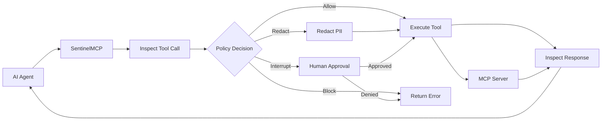

<div align="center">
  
</div>

# SentinelMCP

**The Open-Source MCP Security Gateway for AI Agents**

Built by [Technosive Ltd.](https://technosive.co.uk)

[](LICENSE)
[](go.mod)
[](https://github.com/technosiveuk-ui/SentinelMCP/actions/workflows/ci.yml)

---

> ⚠️ **Alpha Software — v0.1**
>
> SentinelMCP is currently in **Alpha**. The project is under active development and APIs, configuration formats, and graph behaviors **may change** in future releases without advance notice.
>
> **Production warning:** This software is provided as-is. While we strive for security, an Alpha-stage proxy should **not** be your sole defense in a highly regulated production environment without thorough testing. Use at your own risk.
>
> We actively seek early adopters and feedback. If you encounter issues, have suggestions, or want to contribute — please [open an issue](https://github.com/technosiveuk-ui/SentinelMCP/issues). Your input directly shapes the roadmap.

---

## What is SentinelMCP?

SentinelMCP is a security enforcement engine for the **Model Context Protocol (MCP)** that secures AI agent tool calls at runtime. It provides inspection, policy enforcement, PII/secret redaction, and audit logging — sitting between your AI agents and the tools they invoke.

Built in high-performance Go with runtime-native graph orchestration, interrupt/resume capabilities, and sub-millisecond enforcement — enabling human-in-the-loop approval workflows without custom plumbing.

---

## Two Deployment Modes

SentinelMCP can be deployed in two ways, depending on your architecture:

### 1. Proxy Mode (Universal)

A standalone sidecar binary that intercepts HTTP/SSE MCP traffic. Works with **any language** (Python, TypeScript, Go, etc.) and any agent framework. Zero code changes required — just route your MCP traffic through the proxy.

```
AI Agent (any language) → SentinelMCP Proxy → MCP Server
```

### 2. Inline SDK Mode (Go Native)

A Go library imported directly into your application. Wraps MCP tool calls **in-memory** with zero-copy graph orchestration. Provides sub-millisecond latency and deep context awareness — no network hop, no separate process.

```
Go AI Application → SentinelMCP SDK (in-process) → MCP Server
```

This dual-mode architecture is SentinelMCP's key differentiator: competitors like Permit or Envoy only offer network proxies. With the Inline SDK, Go applications get the same security enforcement at a fraction of the latency.

---

## Key Features

- **MCP Proxy (Sidecar)** — Drop-in HTTP/SSE proxy for any MCP client. Transparent to existing agent frameworks.
- **Inline SDK (Go)** — Native Go module for in-process enforcement. Sub-millisecond overhead on the Allow path (19μs p99).
- **Policy Engine** — Local YAML-based policy definitions with hot-reloading. Risk levels (low/medium/high) map to enforcement actions (allow/redact/block/interrupt).
- **Data Loss Prevention (DLP)** — Regex-based PII and secret redaction in tool arguments and responses. 6 built-in patterns (private keys, passwords, API keys, credit cards, SSNs, emails) plus custom regex support.
- **Human-in-the-Loop (HITL)** — Interrupt high-risk tool calls via generic Webhooks and resume via a local API endpoint. BoltDB-backed checkpoints for durable interrupt/resume.
- **Audit Logging** — Structured JSON logging to `stdout` and native OpenTelemetry (OTel) integration for SIEM pipelines.
- **State Management** — BoltDB-backed checkpoints for durable interrupt/resume across process restarts.

---

## 🏗️ Architecture & Extensibility

SentinelMCP is built with a strict separation of concerns to ensure maintainability, testability, and a seamless Open-Core experience.

The `gateway/` package defines all core interfaces and domain types (Policy, DLP, Risk, Audit) with **zero dependencies** on the underlying Eino framework or MCP transport libraries. The `adapter/eino/` package is the *only* package that imports Eino types.

This architectural boundary provides three major benefits:

1. **Framework Agnostic:** If the underlying orchestration framework ever needs to change, only a new adapter is required; the core security engine remains untouched.
2. **Independently Testable:** Core domain logic (policy evaluation, DLP redaction, risk analysis) can be unit-tested cleanly without spinning up MCP servers or LLM graphs.
3. **Architecturally Enforced Open-Core:** Enterprise implementations (Teams/Slack HITL, Nightfall DLP, Control Plane APIs) simply swap into the `GatewayConfig` via interfaces. Zero changes to this OSS codebase are required.

---

## Quickstart

### Proxy Mode

**1. Start the sidecar with Docker:**

```bash
docker run -p 8080:8080 -p 9090:9090 \
  -v ./policies.yaml:/etc/sentinelmcp/config.yaml \
  ghcr.io/technosiveuk-ui/sentinelmcp:latest
```

**2. Define your policies (`policies.yaml`):**

```yaml
schema_version: "1.0"

global:
  default_risk: low
  redaction_mask: "***REDACTED***"

sidecar:
  listen_addr: ":8080"
  health_addr: ":9090"
  transport: streamable_http
  upstream_servers:
    - name: my-tools
      url: "http://localhost:3001/mcp"

tools:
  read_file:
    risk: medium                    # DLP scans args + response
    redact_patterns: [PASSWORD, API_KEY]

  exec_command:
    risk: high                      # Interrupts for human approval
    require_approval: true
    approval_reason: "Shell commands can modify system state"

  "db_*":                           # Glob matching supported
    risk: high
    require_approval: true
```

**3. Route your agent's MCP traffic to `localhost:8080`.**

### Inline SDK Mode

Secure tool calls **in-process** with a small builder API — no sidecar, no network hop, sub-millisecond overhead. Full guide: [`docs/INLINE-SDK.md`](docs/INLINE-SDK.md).

> **Requires v0.2.0+.** The Inline SDK (`sdk/` package) shipped in v0.2.0.

```go
package main

import (
    "context"
    "fmt"
    "log"

    "github.com/technosiveuk-ui/sentinelmcp/gateway"
    "github.com/technosiveuk-ui/sentinelmcp/sdk"
)

func main() {
    // Register plain Go functions as secured tools.
    invoker := sdk.NewFuncInvoker().
        Register("read_file", func(_ context.Context, args map[string]any) (string, error) {
            return fmt.Sprintf("contents of %v", args["path"]), nil
        }).
        Register("exec_command", func(_ context.Context, args map[string]any) (string, error) {
            return fmt.Sprintf("ran %v", args["cmd"]), nil
        })

    // Build the pipeline. StrictDefaults routes unknown tools to redact.
    pipeline, err := sdk.New(invoker).
        WithRisk("exec_command", gateway.RiskHigh). // interrupt for approval
        StrictDefaults().
        Build()
    if err != nil {
        log.Fatal(err)
    }

    // Every call is inspected, DLP-scanned, policy-checked, and audited.
    result, err := pipeline.Run(context.Background(), "read_file", map[string]any{
        "path": "/etc/config.yaml",
    })
    if err != nil {
        log.Fatal(err)
    }
    fmt.Println("Result:", result)
}
```

Run the complete allow / redact / interrupt example:

```bash
go run ./examples/inline-sdk
```

---

## How It Works



**Pipeline flow:**
1. **Inspect** — Serialize tool arguments, run DLP scanning, look up risk level in policy DB
2. **Policy Decision** — Route by risk: low→allow, medium→redact, high→interrupt for approval, or block
3. **Execute** — Call the upstream MCP tool (with redacted arguments if applicable)
4. **Inspect Response** — DLP-scan the tool response, redact findings, emit structured audit event

---

## Architecture

```
sentinelmcp/
├── gateway/               # Core domain (ZERO Eino imports)
│   ├── types.go           # GatewayContext, AuditEvent, DLPFinding, RiskLevel, Decision
│   ├── graph.go           # Pipeline, ToolInvoker, GatewayConfig, MetricsRecorder
│   ├── policy.go          # Policy interface + DefaultPolicy
│   ├── redact.go          # DLPScanner, Redactor + RegexDLPScanner + DefaultRedactor
│   ├── dlp_multi.go       # MultiDLPScanner (compose regex + external)
│   ├── dlp_external.go    # DLPEndpoint interface + ExternalDLPScanner adapter
│   ├── riskdb.go          # RiskDB interface + YAMLRiskDB
│   ├── audit.go           # AuditEmitter interface + Stdout/FileAuditEmitter
│   ├── audit_sink.go      # AuditSink + WriterAuditSink + CompositeAuditEmitter
│   ├── metrics.go         # MetricsRecorder interface + NOPMetricsRecorder
│   └── webhook_approval.go # WebhookApprovalProvider + CLIApprovalProvider
├── sdk/                   # Inline SDK: ergonomic builder over gateway + adapter
│   ├── builder.go         # Builder API (New, With*, StrictDefaults, Build)
│   ├── func_invoker.go    # FuncInvoker — secure plain Go functions
│   └── defaults.go        # Convenience constructors (BuiltinDLP, StdoutAudit, …)
├── adapter/eino/          # Eino framework adapter (ONLY package with Eino imports)
│   ├── graph.go           # BuildGraph() → 3-node graph with interrupt/resume
│   ├── otel_metrics.go    # OTelMetricsRecorder (counters + histograms)
│   ├── otel_audit_emitter.go # OTelAuditEmitter (audit → span events)
│   └── bolt_checkpoint.go # BoltCheckPointStore
├── adapter/sidecar/       # Sidecar proxy adapters
│   ├── invoker.go         # SidecarInvoker (routes to upstream MCP servers)
│   └── discovery.go       # DiscoverTools (upstream MCP server discovery)
├── adapter/siem/          # SIEM audit sink implementations
│   ├── splunk_hec.go      # SplunkHECSink (batching + retry)
│   └── file_rotation.go   # FileRotationSink (size-based + gzip)
├── config/                # YAML config loading, validation, hot-reload
│   ├── config.go          # Load, Validate, ToRiskDB, ToDLPPatterns
│   └── watcher.go         # ConfigWatcher (fsnotify + debounce)
├── cmd/
│   ├── sentinelmcp/       # Sidecar proxy binary
│   │   ├── main.go        # Bootstrap: config → discover → pipeline → proxy → admin
│   │   ├── proxy.go       # Proxy MCP server wrapping the pipeline
│   │   ├── health.go      # Admin server: /healthz, /readyz, /api/v1/approval/resume
│   │   └── config.go      # GatewayConfig wiring (audit sinks, approval, OTel)
│   ├── upstream/          # Demo upstream MCP server (3 tools)
│   ├── testclient/        # Demo test client (3 enforcement flows)
│   └── demo/              # In-process demo (4 MCP servers)
├── examples/
│   └── inline-sdk/        # Runnable allow/redact/interrupt SDK demo
├── Dockerfile             # Multi-stage distroless build
├── docker-compose.yml     # One-command demo
└── config/
    ├── config.yaml        # Default config
    └── docker-config.yaml # Docker-specific config
```

---

## Open Source vs. Enterprise

| Feature | OSS (This Repo — Apache 2.0) | Enterprise (Commercial) |
|:--------|:------------------------------|:-------------------------|
| **Deployment** | Sidecar Proxy + Inline Go SDK | Centralized Control Plane |
| **Policies** | Local YAML with hot-reload | Centralized API/DB, Web UI |
| **DLP** | Regex-based (6 built-in + custom) | Enterprise DLP connectors (API-based) |
| **HITL Approval** | Generic Webhook + CLI | Corporate communication channels |
| **Audit** | JSON stdout + OTel | SIEM Aggregation, Compliance PDFs |
| **Auth** | None (single-tenant) | SSO, RBAC, multi-tenant |
| **State** | BoltDB (local) | Distributed (Postgres) |

> **Note:** The Enterprise Control Plane connects to the sidecar/SDK by implementing the `gateway/` interfaces (`Policy`, `DLPScanner`, `AuditEmitter`, `ApprovalProvider`, etc.). Zero changes to this OSS codebase are required.

---

## Performance

Benchmarks on Apple M1 Pro (Go 1.26):

| Path | Latency | Allocations |
|------|---------|-------------|
| Allow (critical path) | **19μs** | 182 |
| Redact | 19μs | 185 |
| Interrupt | 33μs | 303 |
| DLP scan | 9.3μs | 0 |
| RiskDB lookup | 71ns | 0 |
| Policy decide | 193ns | 4 |

### NFR Validation

| NFR | Target | Validated By |
|-----|--------|-------------|
| p99 latency | ≤500μs Allow | `BenchmarkPipeline_Allow` — 19μs (26× under budget) |
| Memory | <10MB heap per 1k calls | `TestMemory_*` — 0.73MB concurrent |
| Concurrency | 100+ concurrent, no deadlock | `TestLoad_*` — 1000 concurrent, 0 deadlocks |
| Default-deny | Block on all failures | `TestDegradation_*` — all error paths block |

---

## Test Coverage

90+ tests across 6 packages, 7 benchmarks, all passing with `-race`:

```bash
# Run all tests
go test ./... -race -count=1

# NFR validation
go test ./adapter/eino/ -run "TestLoad_|TestMemory_|TestDegradation_" -race -v

# Sidecar E2E
go test ./cmd/sentinelmcp/ -race -v

# Benchmarks
go test ./adapter/eino/ -bench=. -benchmem
```

---

## Contributing

Contributions are welcome! Please read [CONTRIBUTING.md](CONTRIBUTING.md) for details.

All contributors must sign off on their commits (DCO — Developer Certificate of Origin) to ensure they have the right to submit their code under the Apache 2.0 license.

```
Signed-off-by: Your Name <your.email@example.com>
```

---

## License, Trademark & Extensibility

**Open Source Code:**
The code in this repository, including the `gateway/` interfaces and `adapter/` implementations, is licensed under the [Apache 2.0 License](LICENSE). You are free to use, modify, and distribute this code in accordance with that license.

**Enterprise Extensions & Interface Implementations:**
This repository defines extensibility interfaces (e.g., `Policy`, `DLPScanner`, `ApprovalProvider`, `AuditEmitter`) in the `gateway/` package to allow for custom integrations. While the interfaces themselves are Apache 2.0, **proprietary implementations of these interfaces provided by Technosive Ltd.** (such as the SentinelMCP Enterprise Control Plane, corporate communication HITL integrations, and advanced DLP connectors) are licensed separately under a commercial license and are not included in this repository.

Implementing these interfaces in your own code does not require you to license your implementations under Apache 2.0, nor does it obligate you to open-source your custom integrations.

**Trademark:**
"SentinelMCP" and the SentinelMCP logo are trademarks of Technosive Ltd. The Apache 2.0 license does not grant you the right to use the SentinelMCP trademark to endorse or promote products or services derived from this software without prior written permission from Technosive Ltd.
