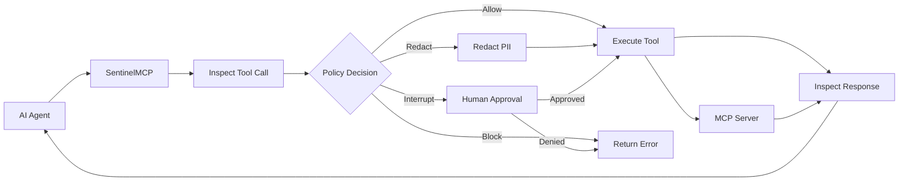

<div align="center">
  
</div>

# SentinelMCP

**The Open-Source MCP Security Gateway for AI Agents**

Built by [Technosive Ltd.](https://technosive.com)

[](LICENSE)
[](go.mod)
[](#)

---

> ⚠️ **Alpha Software — v0.1**
>
> SentinelMCP is currently in **Alpha**. The project is under active development and APIs, configuration formats, and graph behaviors **may change** in future releases without advance notice.
>
> **Production warning:** This software is provided as-is. While we strive for security, an Alpha-stage proxy should **not** be your sole defense in a highly regulated production environment without thorough testing. Use at your own risk.
>
> We actively seek early adopters and feedback. If you encounter issues, have suggestions, or want to contribute — please [open an issue](https://github.com/technosiveuk-ui/SentinelMCP/issues). Your input directly shapes the roadmap.

---

## What is SentinelMCP?

SentinelMCP is a security enforcement engine for the **Model Context Protocol (MCP)** that secures AI agent tool calls at runtime. It provides inspection, policy enforcement, PII/secret redaction, and audit logging — sitting between your AI agents and the tools they invoke.

Built on the [Eino framework](https://github.com/cloudwego/eino) (Go) for high-performance graph orchestration with native interrupt/resume capabilities, enabling human-in-the-loop approval workflows without custom plumbing.

---

## Two Deployment Modes

SentinelMCP can be deployed in two ways, depending on your architecture:

### 1. Proxy Mode (Universal)

A standalone sidecar binary that intercepts HTTP/SSE MCP traffic. Works with **any language** (Python, TypeScript, Go, etc.) and any agent framework. Zero code changes required — just route your MCP traffic through the proxy.

```
AI Agent (any language) → SentinelMCP Proxy → MCP Server
```

### 2. Inline SDK Mode (Go/Eino Native)

A Go library imported directly into your application. Wraps MCP tool calls **in-memory** using Eino graph orchestration. Provides sub-millisecond latency and deep context awareness — no network hop, no separate process.

```
Go AI Application → SentinelMCP SDK (in-process) → MCP Server
```

This dual-mode architecture is SentinelMCP's key differentiator: competitors like Permit or Envoy only offer network proxies. With the Inline SDK, Go applications get the same security enforcement at a fraction of the latency.

---

## Key Features

- **MCP Proxy (Sidecar)** — Drop-in HTTP/SSE proxy for any MCP client. Transparent to existing agent frameworks.
- **Inline SDK (Go)** — Native Go module for in-process enforcement. Sub-millisecond overhead on the Allow path (19μs p99).
- **Policy Engine** — Local YAML-based policy definitions with hot-reloading. Risk levels (low/medium/high) map to enforcement actions (allow/redact/block/interrupt).
- **Data Loss Prevention (DLP)** — Regex-based PII and secret redaction in tool arguments and responses. 6 built-in patterns (private keys, passwords, API keys, credit cards, SSNs, emails) plus custom regex support.
- **Human-in-the-Loop (HITL)** — Interrupt high-risk tool calls via generic Webhooks and resume via a local API endpoint. BoltDB-backed checkpoints for durable interrupt/resume.
- **Audit Logging** — Structured JSON logging to `stdout` and native OpenTelemetry (OTel) integration for SIEM pipelines.
- **State Management** — BoltDB-backed checkpoints for durable interrupt/resume across process restarts.

---

## Quickstart

### Proxy Mode

**1. Start the sidecar with Docker:**

```bash
docker run -p 8080:8080 -p 9090:9090 \
  -v ./policies.yaml:/etc/sentinelmcp/config.yaml \
  ghcr.io/technosiveuk-ui/sentinelmcp:latest
```

**2. Define your policies (`policies.yaml`):**

```yaml
schema_version: "1.0"

global:
  default_risk: low
  redaction_mask: "***REDACTED***"

sidecar:
  listen_addr: ":8080"
  health_addr: ":9090"
  transport: streamable_http
  upstream_servers:
    - name: my-tools
      url: "http://localhost:3001/mcp"

tools:
  read_file:
    risk: medium                    # DLP scans args + response
    redact_patterns: [PASSWORD, API_KEY]

  exec_command:
    risk: high                      # Interrupts for human approval
    require_approval: true
    approval_reason: "Shell commands can modify system state"

  "db_*":                           # Glob matching supported
    risk: high
    require_approval: true
```

**3. Route your agent's MCP traffic to `localhost:8080`.**

### Inline SDK Mode

**1. Import the SDK into your Go application:**

```go
package main

import (
    "context"
    "fmt"
    "log"

    "github.com/technosiveuk-ui/sentinelmcp/gateway"
    "github.com/technosiveuk-ui/sentinelmcp/adapter/eino"
)

func main() {
    // Define policies
    riskDB := gateway.NewYAMLRiskDB(map[string]gateway.ToolRisk{
        "read_file":    {Level: gateway.RiskMedium},
        "exec_command": {Level: gateway.RiskHigh, RequireApproval: true},
    }, gateway.ToolRisk{Level: gateway.RiskLow})

    // Build DLP scanner with built-in patterns
    scanner, err := gateway.NewRegexDLPScanner(gateway.BuiltinPatterns())
    if err != nil {
        log.Fatal(err)
    }

    // Configure and build the pipeline
    cfg := gateway.GatewayConfig{
        Policy:       gateway.NewDefaultPolicy(),
        RiskDB:       riskDB,
        DLPScanner:   scanner,
        AuditEmitter: gateway.NewStdoutAuditEmitter(nil),
        ToolInvoker:  myToolInvoker{}, // implements gateway.ToolInvoker
    }

    pipeline, err := eino.BuildGraph(cfg)
    if err != nil {
        log.Fatal(err)
    }

    // Execute a tool call through the secure pipeline
    result, err := pipeline.Run(context.Background(), "read_file", map[string]any{
        "path": "/etc/config.yaml",
    })
    if err != nil {
        log.Fatal(err)
    }
    fmt.Println("Result:", result)
}
```

**2. That's it.** Every tool call is now inspected, DLP-scanned, policy-checked, and audited — all in-process.

---

## How It Works



**Pipeline flow:**
1. **Inspect** — Serialize tool arguments, run DLP scanning, look up risk level in policy DB
2. **Policy Decision** — Route by risk: low→allow, medium→redact, high→interrupt for approval, or block
3. **Execute** — Call the upstream MCP tool (with redacted arguments if applicable)
4. **Inspect Response** — DLP-scan the tool response, redact findings, emit structured audit event

---

## Architecture

```
sentinelmcp/
├── gateway/               # Core domain (ZERO Eino imports)
│   ├── types.go           # GatewayContext, AuditEvent, DLPFinding, RiskLevel, Decision
│   ├── graph.go           # Pipeline, ToolInvoker, GatewayConfig, MetricsRecorder
│   ├── policy.go          # Policy interface + DefaultPolicy
│   ├── redact.go          # DLPScanner, Redactor + RegexDLPScanner + DefaultRedactor
│   ├── dlp_multi.go       # MultiDLPScanner (compose regex + external)
│   ├── dlp_external.go    # DLPEndpoint interface + ExternalDLPScanner adapter
│   ├── riskdb.go          # RiskDB interface + YAMLRiskDB
│   ├── audit.go           # AuditEmitter interface + Stdout/FileAuditEmitter
│   ├── audit_sink.go      # AuditSink + WriterAuditSink + CompositeAuditEmitter
│   ├── metrics.go         # MetricsRecorder interface + NOPMetricsRecorder
│   └── webhook_approval.go # WebhookApprovalProvider + CLIApprovalProvider
├── adapter/eino/          # Eino framework adapter (ONLY package with Eino imports)
│   ├── graph.go           # BuildGraph() → 3-node graph with interrupt/resume
│   ├── otel_metrics.go    # OTelMetricsRecorder (counters + histograms)
│   ├── otel_audit_emitter.go # OTelAuditEmitter (audit → span events)
│   └── bolt_checkpoint.go # BoltCheckPointStore
├── adapter/sidecar/       # Sidecar proxy adapters
│   ├── invoker.go         # SidecarInvoker (routes to upstream MCP servers)
│   └── discovery.go       # DiscoverTools (upstream MCP server discovery)
├── adapter/siem/          # SIEM audit sink implementations
│   ├── splunk_hec.go      # SplunkHECSink (batching + retry)
│   └── file_rotation.go   # FileRotationSink (size-based + gzip)
├── config/                # YAML config loading, validation, hot-reload
│   ├── config.go          # Load, Validate, ToRiskDB, ToDLPPatterns
│   └── watcher.go         # ConfigWatcher (fsnotify + debounce)
├── cmd/
│   ├── sentinelmcp/       # Sidecar proxy binary
│   │   ├── main.go        # Bootstrap: config → discover → pipeline → proxy → admin
│   │   ├── proxy.go       # Proxy MCP server wrapping the pipeline
│   │   ├── health.go      # Admin server: /healthz, /readyz, /api/v1/approval/resume
│   │   └── config.go      # GatewayConfig wiring (audit sinks, approval, OTel)
│   ├── upstream/          # Demo upstream MCP server (3 tools)
│   ├── testclient/        # Demo test client (3 enforcement flows)
│   └── demo/              # In-process demo (4 MCP servers)
├── Dockerfile             # Multi-stage distroless build
├── docker-compose.yml     # One-command demo
└── config/
    ├── config.yaml        # Default config
    └── docker-config.yaml # Docker-specific config
```

### Anti-Corruption Layer

The `gateway/` package defines all interfaces and domain types with **zero dependencies on Eino or MCP libraries**. The `adapter/eino/` package is the only one that imports Eino types. This means:

- If SentinelMCP ever needs a different orchestration framework, a new adapter is created alongside
- Core domain logic (policy, DLP, risk, audit) is independently testable
- The open-core boundary is architecturally enforced: Enterprise implementations swap into `GatewayConfig` without code changes

---

## Open Source vs. Enterprise

| Feature | OSS (This Repo — Apache 2.0) | Enterprise (Commercial) |
|:--------|:------------------------------|:-------------------------|
| **Deployment** | Sidecar Proxy + Inline Go SDK | Centralized Control Plane |
| **Policies** | Local YAML with hot-reload | Centralized API/DB, Web UI |
| **DLP** | Regex-based (6 built-in + custom) | Enterprise DLP connectors (API-based) |
| **HITL Approval** | Generic Webhook + CLI | Corporate communication channels |
| **Audit** | JSON stdout + OTel | SIEM Aggregation, Compliance PDFs |
| **Auth** | None (single-tenant) | SSO, RBAC, multi-tenant |
| **State** | BoltDB (local) | Distributed (Postgres) |

> **Note:** The Enterprise Control Plane connects to the sidecar/SDK by implementing the `gateway/` interfaces (`Policy`, `DLPScanner`, `AuditEmitter`, `ApprovalProvider`, etc.). Zero changes to this OSS codebase are required.

---

## Performance

Benchmarks on Apple M1 Pro (Go 1.26):

| Path | Latency | Allocations |
|------|---------|-------------|
| Allow (critical path) | **19μs** | 182 |
| Redact | 19μs | 185 |
| Interrupt | 33μs | 303 |
| DLP scan | 9.3μs | 0 |
| RiskDB lookup | 71ns | 0 |
| Policy decide | 193ns | 4 |

### NFR Validation

| NFR | Target | Validated By |
|-----|--------|-------------|
| p99 latency | ≤500μs Allow | `BenchmarkPipeline_Allow` — 19μs (26× under budget) |
| Memory | <10MB heap per 1k calls | `TestMemory_*` — 0.73MB concurrent |
| Concurrency | 100+ concurrent, no deadlock | `TestLoad_*` — 1000 concurrent, 0 deadlocks |
| Default-deny | Block on all failures | `TestDegradation_*` — all error paths block |

---

## Test Coverage

90+ tests across 6 packages, 7 benchmarks, all passing with `-race`:

```bash
# Run all tests
go test ./... -race -count=1

# NFR validation
go test ./adapter/eino/ -run "TestLoad_|TestMemory_|TestDegradation_" -race -v

# Sidecar E2E
go test ./cmd/sentinelmcp/ -race -v

# Benchmarks
go test ./adapter/eino/ -bench=. -benchmem
```

---

## Contributing

Contributions are welcome! Please read [CONTRIBUTING.md](CONTRIBUTING.md) for details.

All contributors must sign off on their commits (DCO — Developer Certificate of Origin) to ensure they have the right to submit their code under the Apache 2.0 license.

```
Signed-off-by: Your Name <your.email@example.com>
```

---

## License

SentinelMCP is licensed under the [Apache 2.0 License](LICENSE). Copyright 2024-2026 Technosive Ltd.
